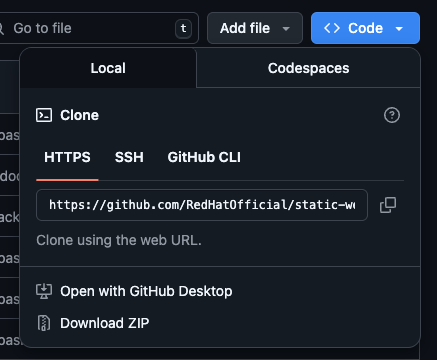

# Getting Started

## Fork and Clone the Repository

Fork the repositorty of the site on our [GitHub](https://https://github.com/RedHatOfficial/static-website-template-for-ospo). 

Clone your fork to your own computer then using this command and replacing the link with your own HTTPS clone link found underneath the **Code** button (see image below):

```bash
git clone https://github.com/[USERNAME]/[NAME-OF-FORK]
```



## Start the Site

Install [Node.js](https://nodejs.org/en) if you do not have it on your local machine.

Run `node --version` in your terminal to check to see if you have it installed correctly. It should come back with a version number (vX.Y.Z):

Run a fresh install of npm on the project:

```bash
cd [NAME-OF-FILE]
npm install
```

Run the server itself with this command:

```bash
npm start
```

The `cd` command changes the directory you're working with. 

The `npm start` command builds your website locally and serves it through a development server, ready for you to view at http://localhost:3000/.

Open `docs/intro.md` (this page) and edit some lines: the site **reloads automatically** and displays your changes.

## Using Docusaurus

Docusaurus is a static-site generator that convetakes Markdown files and donverts them into a documentation website. It is written in JavaScript however no prior knowledge of JavaScript is needed to edit the website.